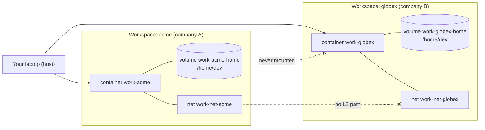

# How `work` sets up and isolates multiple workspaces on one machine

> Audience: anyone who wants to understand **what `work` actually does behind
> the scenes** to make it safe to run code, agents, and credentials for several
> companies on the same laptop without them ever touching each other.
>
> Every claim below is grounded in the source. File + section references are
> included so you can verify them yourself.

## TL;DR

Each workspace (= one company / client / project) is a **fully separate Linux
container** with its **own private disk** and its **own private network**. There
is no path — filesystem or network — from one workspace to another. `work` holds
**no secrets** and **never moves credentials around**. `work doctor` re-checks
every one of these guarantees on demand.

The host engine is a portability layer, not part of the isolation model:

- **Linux:** Podman is the preferred engine, rootless where practical; Docker is
  the Docker-compatible fallback.
- **macOS:** Podman machine and Podman Desktop are supported. Docker, OrbStack,
  and Colima remain compatible alternatives; OrbStack is not the default.
- **Windows:** WSL2 only. Install and run `work` inside the WSL2 distribution,
  with Podman available inside that distribution. Native Windows containers and
  native Windows backends are out of scope.

Automatic engine selection follows that platform policy. `WORK_ENGINE` accepts
`podman|docker|orbstack|colima` and overrides automatic selection; it must name
an installed, running engine and is most useful for testing or for choosing
between multiple local backends. An invalid or unavailable override fails
instead of silently selecting a different engine.

This platform and selection contract is captured in the new
[`multiplatform portability design note`](superpowers/specs/2026-08-17-multiplatform-portability-design.md).



---

## 1. The problem this solves

AI coding agents (Claude Code, Codex, z.ai, Gemini CLI, …) can **read the whole
filesystem** they run in and **persist memory across sessions**. If two clients'
code and credentials live in the same OS account / the same directory tree, an
agent running for company A can trivially read company B's source, keys, and
memory. **Switching env vars or OS user accounts is not enough** — same-disk
reads still work.

`work`'s entire purpose is a **hard, structural guarantee against cross-context
data breach**. Source: [`SECURITY.md`](../SECURITY.md), and the design spec's
[Threat model](./superpowers/specs/2026-07-28-work-cli-design.md).

---

## 2. Threat model — what it does and does not defend against

| Defends against (by design) | Out of scope (by design) |
|---|---|
| A *non-malicious* agent in workspace A reading workspace B's files/creds/memory | Kernel / container-engine escapes (report those to the relevant engine upstream) |
| One workspace reaching another's network or volume | What you choose to install/audit *inside* your own workspace |
| Credentials leaking across clients on shared hardware | A *hostile* workload attacking the kernel |

The adversary is a **well-meaning AI agent that may read the filesystem and
remember things**, not a malicious attacker targeting the kernel. `work` enforces
the boundary at the **OS container layer** — the strongest boundary short of
separate physical machines.

---

## 3. The four isolation invariants

Every workspace container is created to satisfy all four, and `work doctor`
re-verifies them. (Source: [`crates/core/src/doctor.rs`](../crates/core/src/doctor.rs).)

1. **One dedicated network per workspace** (`work-net-<ws>`), and **only that
   network**. Workspace containers are on separate L2 segments, so they cannot
   address each other — there is no network path between them.
2. **One named volume per workspace** (`work-<ws>-home`), mounted at `/home/dev`
   and **nowhere else**. No host bind-mounts.
3. **No container may mount another workspace's volume** (cross-volume check).
4. **No published host ports**, and the container runs as a **non-root user**.

---

## 4. Resource naming scheme

Names are deterministic and namespaced so workspaces can never collide.
(Source: [`crates/core/src/naming.rs`](../crates/core/src/naming.rs).)

| Resource | Name pattern | Example |
|---|---|---|
| Container | `work-<ws>` | `work-acme` |
| Named volume (the private disk) | `work-<ws>-home` | `work-acme-home` |
| Dedicated bridge network | `work-net-<ws>` | `work-net-acme` |

Workspace names are validated to lowercase `[a-z0-9][a-z0-9-]*`, length ≤ 40, and
cannot collide with a CLI verb (`new`, `rm`, `start`, …). This guarantees every
derived resource name is unique and unambiguous.

---

## 5. What `work new <ws>` actually does (the setup, step by step)

This is the core "behind the scenes." (Source: `Workspace::create` in
[`crates/core/src/workspace.rs`](../crates/core/src/workspace.rs), ~lines 67–206.)

1. **Validate** the name and reject duplicates.
2. **Select the container engine** — prefer Podman on Linux and in WSL2, prefer
   Podman on macOS when available, then use a Docker-compatible fallback. On
   macOS, OrbStack and Colima remain supported compatibility choices. An
   explicit `WORK_ENGINE` override takes precedence. The selected CLI is used
   for all lifecycle operations;
   Podman uses `podman`, while Docker-compatible engines use their compatible
   `docker` command.
   (Selection is implemented by `detect()` in
   [`crates/core/src/engine.rs`](../crates/core/src/engine.rs).)
3. **Ensure the base image exists** — build `work-base:latest` on first use, or
   pull a custom image you configured. (`ensure_image`.)
4. **Validate import sources first** (before creating anything), so a bad path
   fails fast with **no orphaned volume/network/container** left behind.
5. **Create the resources** — only three primitives:
   - `<engine> volume create work-<ws>-home`
   - `<engine> network create work-net-<ws>`
   - `<engine> run …` (see the compatibility example in §6)
6. **Install the browser bridge shim** (best-effort) so in-container tools can
   later forward `xdg-open`/OAuth URLs to your host browser.
7. **Seed configs (optional)** — copy dotfiles/shell/herdr/starship config **into
   the volume**, owned by `dev`. A warning is printed because anything copied now
   lives in that workspace's volume. With no imports, a minimal workspace-aware
   default prompt config is written instead.
8. **Persist non-secret metadata** to `~/.config/work/workspaces/<ws>.toml`
   (name, image, optional git identity, shell, created-at).
9. **Apply git identity** (optional `user.name`/`user.email`) purely to prevent
   wrong-identity commits.

Nothing in this sequence reads, stores, or transports a secret.

---

## 6. The runtime command that builds the wall

`run_opts()` builds the options; `Engine::run()` turns them into flags for the
selected runtime CLI. The command shape is the same across the supported
Docker-compatible interfaces.
(Source: `workspace.rs` `run_opts` + `engine.rs` `run`.)

For compatibility documentation, the effective command for a workspace `acme`
is shown below using the Docker CLI spelling. With Podman, replace the leading
`docker` with `podman`; do not interpret this example as a requirement to run
Docker or to use a Docker Desktop backend:

```bash
docker run -d \
  --name work-acme \
  --network work-net-acme \
  --restart unless-stopped \
  -v work-acme-home:/home/dev \
  -w /home/dev \
  -e WORK=acme \
  -e WORKSPACE=acme \
  -e BROWSER=/usr/local/bin/xdg-open \
  -e NERD_FONTS=1 \
  work-base:latest \
  sleep infinity
```

What is **conspicuously absent** — and why each omission matters:

| Not present | Why it matters for isolation |
|---|---|
| No `-p` / `--publish` | No host port is exposed, so nothing on the host (or another workspace) can reach this container's ports. |
| No `--network host` / no second `--network` | The container is on **only** its own bridge; it has no shared L2 with any other workspace. |
| No host bind-mount (`-v /host/path:...`) | The only mount is the workspace's **own** named volume; host files are never exposed. |
| `sleep infinity` as the command | The container is a long-lived sandbox the host execs into — not a service that publishes anything. |

The container runs as **whatever user the base image defaults to**, which is the
non-root user `dev` (`FROM work-base:latest` ships `dev` @ `/home/dev`).
`work doctor` verifies the running user is not root — see §7.

The env vars `WORK`/`WORKSPACE` are **identity metadata only** (so prompts and
tools can name the workspace); they carry no secret.

---

## 7. `work doctor` — how isolation is verified

`doctor` collects facts via the selected runtime's inspect interface and runs
**pure, unit-tested** analysis over them. (Source:
[`crates/core/src/doctor.rs`](../crates/core/src/doctor.rs).)

Per workspace it checks:

- **Isolation** — the container's *only* network is `work-net-<ws>`, and its
  *only* mount is the volume `work-<ws>-home` → `/home/dev` (and it is a *volume*
  mount, not a host bind mount — a bind mount's source starts with `/` and is
  rejected).
- **Cross-volume** — across *all* workspaces, no container may mount another
  workspace's volume. (Defends against a misconfigured container reaching a
  foreign disk.)
- **Hardening** — restart policy is `unless-stopped`; the container does **not**
  run as `root`/`0`; the running image matches the configured image; and there
  are **zero published host ports**.

It fails loudly (non-`ok` rows) if any invariant is violated, so a broken
isolation never stays silent. Run it any time:

```bash
work doctor
```

---

## 8. Host-side config — secret-free by design

`work` keeps two config locations on the host
([`crates/core/src/config.rs`](../crates/core/src/config.rs)):

| Path | Holds | Secret? |
|---|---|---|
| `~/.config/work/config.toml` | Global prefs: default image, optional default dotfiles to seed, banner toggle, update-check toggle | **Never** |
| `~/.config/work/workspaces/<ws>.toml` | Per-workspace metadata: name, image, optional git identity, shell, created-at | **Never** |

There is **no field anywhere** for a token, key, password, or login. `work` does
not model secrets because it does not handle them.

---

## 9. Secrets: what `work` never touches

> `work` is a **session + isolation manager**. It does **not** install tools and
> does **not** manage credentials.

- You install and authenticate your **own** tools (Claude Code, `gh`, …) **inside**
  each container.
- Those logins/credentials live **only inside that workspace's volume** at
  `/home/dev`.
- `work` never reads, writes, copies, or moves them; they never reach the host
  filesystem via `work`.

The one thing to be careful about: when you **import** a host config
(`--import-shell-config`, `--import-dotfiles`, …) the file is copied verbatim
into the volume, and `work` warns you to make sure it is **secret-free**.

---

## 10. Workspace lifecycle

| Command | Effect | Data safe? |
|---|---|---|
| `work new <ws>` | create volume + network + container | — |
| `work <ws>` | ensure running; attach to the in-container herdr runtime | yes |
| `work stop <ws>` | stop the container (ends the session; **files persist**) | yes |
| `work stop --all` / `work stop-all` | stop every workspace container | yes |
| `work start <ws>` | start again | yes |
| `work rm <ws>` | remove container + network + config; **keep the volume** | yes |
| `work rm <ws> --purge` | also **delete the volume** (irreversible) | **data loss** |

Destructive operations are gated by a tested safety policy
([`crates/core/src/safety.rs`](../crates/core/src/safety.rs)): `--purge` (data
loss) always requires `--yes` or an interactive TTY; `stop`/`rm` only prompt when
there is a **live session** to lose.

---

## 11. Verify it yourself

```bash
work doctor                       # re-checks every invariant for every workspace
# Use the selected CLI. This Docker spelling is a compatibility example:
docker inspect work-acme --format '{{json .NetworkSettings.Networks}}'
docker inspect work-acme --format '{{json .Mounts}}'
docker inspect work-acme --format '{{.Config.User}} · {{json .NetworkSettings.Ports}}'
```

With Podman, run the same inspections as `podman inspect …`. The output should
be equivalent for the fields used by this guide.

For `acme` you should see: exactly one network (`work-net-acme`), exactly one
volume mount (`work-acme-home` → `/home/dev`), a non-root user, and no published
ports — and the **same** for every other workspace, each on its own network and
volume.

## 12. Engine and platform troubleshooting

### Podman on Linux

Prefer a rootless installation. Run `podman info` as the same user that will run
`work`; using `sudo podman` creates a different engine state and can make
workspaces appear to be missing. If the command fails, start or repair the
Podman service according to your distribution, then rerun `podman info` and
`work doctor`.

### Podman machine on macOS

Podman on macOS requires a running Linux machine. Check it with:

```bash
podman machine list
podman machine start
podman info
```

If no machine exists, initialize one with `podman machine init` before starting
it. Podman Desktop can perform the same lifecycle operations. A stopped machine
is different from a missing CLI: install the CLI first, then start the machine.

### Windows + WSL2

`work` is supported only from a WSL2 Linux distribution. From Windows,
`wsl --status` and `wsl -l -v` can confirm that WSL2 is enabled; inside the
distribution, verify `podman info` and run `work doctor`. Install Podman inside
the distribution rather than relying on a Windows-only Podman or Docker backend.
Native Windows containers, PowerShell execution, and a Windows-native engine
are not supported paths.

### Override and test the selected engine

Use an override to avoid ambiguous local installations:

```bash
WORK_ENGINE=podman work doctor
WORK_ENGINE=docker work doctor
```

The override is a selection request, not a way to start an engine or convert an
existing workspace between daemons. If a workspace was created on another
daemon, switch back to that engine or treat the migration as a separate data
operation; never assume two engines share volumes.

Finally, a passing unit suite or `work doctor` run is not proof of end-to-end
compatibility. The real integration tests must run against a live engine and
exercise create, inspect, attach, lifecycle, and cleanup behavior. Contributors
should run the ignored integration suite documented in
[`CONTRIBUTING.md`](../CONTRIBUTING.md).
