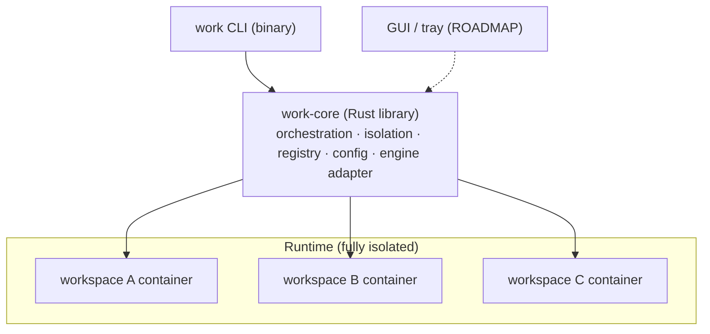

# `work` — Isolated Multi-Context Development CLI

- **Date:** 2026-07-28
- **Status:** Design approved — pending implementation plan
- **Owner:** Lucas Coelho
- **Project:** `work-cli` · open source (MIT) · Rust
- **Scope:** v1 is a CLI; GUI/tray are on the roadmap (see Roadmap)
- **Targets:** macOS now, Linux later (shared codebase)

## Problem (generic)

Many developers juggle **multiple unrelated contexts** on one machine — an agency
with several clients, a contractor across employers, work-vs-personal, multiple
cloud/tenant accounts — and increasingly drive **AI coding agents** (Claude Code,
Codex, z.ai, Gemini CLI, …) that can read the filesystem and persist memory across
sessions. There is a hard requirement: **no context's code, credentials, or
agent-state may reach another.** Switching macOS accounts is inconvenient; swapping
env vars is insufficient because an agent running as the user can read sibling
directories.

`work` gives each context an **isolated, persistent container** with its own tools,
git identity, credentials, and repos — all drivable from one terminal, concurrently,
without account switching.

**Documented example (not the definition).** Lucas works across three companies —
`lagoasoft`, `shopvision`, `coda` — each with its own Claude Code / Codex / z.ai
subscriptions. These are just three `work` workspaces; the tool is generic.

## Goal / Non-goals

**Goal.** An open-source CLI, `work`, built on a shared Rust core that creates and
drives one **isolated, persistent Linux container per workspace** via a
container-engine abstraction, enforces isolation at the container/network/volume
boundary, and is fully user-configured (no hardcoded contexts). Secrets never leave a
workspace's container.

**Non-goals (v1).**

- GUI / menu-bar tray (roadmap).
- Defending against a malicious host-level attacker or kernel/container escape.
- Managing billing or the subscriptions themselves.
- Replacing git — `work` just scopes git per workspace.
- A long-running daemon (deferred; see Roadmap).

## Hard constraints

- Driven from one login session; **no OS account switching**.
- Workspaces run **concurrently**, on-screen at the same time.
- **Tool-pluggable**: support many terminal coding agents via a registry.
- **Container-engine-agnostic**: works with OrbStack (recommended on macOS), Docker,
  Podman, Colima — whatever the user has.
- **Config-first**: contexts are user data, never hardcoded.

## Threat model

The adversary is a **non-malicious AI coding agent** that may read the filesystem
and persist memory/context across sessions. Cross-context reads/exfiltration are
prevented by OS-level container boundaries. Containers share the host kernel
(acceptable for this model); escalate to full VMs only if a hostile-workload
requirement emerges. Directory/env-var switching is explicitly rejected — it does
not stop an agent running as the user from reading sibling directories.

## Layered architecture (v1 = core + CLI)

Isolation logic lives in **exactly one place** — the core library. The CLI is a thin
client. A GUI/tray (later) will be an additional client of the same core.



**Workspace layout**

```
work-cli/
  Cargo.toml                 # workspace
  crates/
    core/                    # work-core lib: orchestration, isolation, registry, config, engine adapter
    cli/                     # `work` binary — thin client over core
  LICENSE                    # MIT
  README.md  CONTRIBUTING.md
```

## Runtime isolation (the confidentiality wall)

- **Container engine:** abstracted — auto-detect OrbStack → Docker → Podman → Colima
  (or take from config). Not locked to OrbStack.
- **One persistent container per workspace**, from a shared base image `work-base:latest`.
- **Per-workspace named Docker volume** mounted at `/home/dev` — entire home persists
  (tools, credentials, repos, dotfiles). Repos under `~/repos`.
- **Per-workspace dedicated bridge network** (`work-net-<ws>`), each NAT'd to the
  internet independently. Workspace containers **cannot address each other** (no
  shared L2), so there is no network path between workspaces.
- **Secrets live only inside the workspace's volume** — OAuth tokens, SSH private
  keys, API keys are never written to the host filesystem in plaintext.
- **Host-side config** (`~/.config/work/workspaces/<ws>.toml`) holds only non-secret
  metadata: display name, git identity, enabled tools, volume/network names, image tag.

## Base image (`work-base:latest`)

`FROM node:20-bookworm-slim` (Claude Code, Codex CLI, z.ai coding-helper, and most
terminal agents are Node-based). Adds: `git`, `openssh-client`, `ca-certificates`,
`tmux`, `zsh`, `curl`, `jq`, plus per-tool system deps declared in the registry.
Creates a non-root user `dev` (Claude Code refuses root). Tool installs happen
in-container at bootstrap and persist via the home volume.

## Tool registry

Tools are **data, not code**. Each terminal agent is a definition consumed by
`work-core`:

```toml
# schema (illustrative)
[tool.claude-code]
install = "npm i -g @anthropic-ai/claude-code"
config_dir = "~/.claude"
login = "oauth"          # oauth | apikey | none
env = { CLAUDE_CONFIG_DIR = "~/.claude" }

[tool.codex]
install = "npm i -g @openai/codex"
config_dir = "~/.codex"
login = "oauth"

[tool.zai]
install = "npm i -g @z_ai/coding-helper"
login = "apikey"
env = { ZAI_API_KEY = "" }
```

A workspace enables a subset; `work new`/`work login` iterate over the enabled set.
Candidate tools: Claude Code, Codex CLI, z.ai, Gemini CLI, Qwen Code, Aider,
OpenCode, Goose, Crush, Amazon Q CLI, Copilot CLI, Cody, Amp. Most share the
npm + config-dir + oauth-or-apikey shape.

## Per-workspace bootstrap — `work new <ws>`

1. Create volume `work-<ws>-home` and network `work-net-<ws>`.
2. Start container `work-<ws>` from `work-base`, on its own network, volume at
   `/home/dev`, running as `dev`.
3. Apply git identity (`user.name` / `user.email`) from config.
4. Generate an SSH ed25519 keypair in `~/.ssh`; print the public key to add to that
   workspace's git account.
5. Install the workspace's enabled tools from the registry.
6. Run the `work login <ws>` flows.

## Auth flow — `work login <ws>`

- **oauth tools (Claude Code, Codex, …):** OAuth login executed **inside the
  container**; the CLI forwards the OAuth callback port to the host so the host
  browser completes the flow; token persists in the volume (real paid subscription).
- **apikey tools (z.ai, …):** `work login` prompts for the key, stores it in the
  container env/config (in-volume).
- **Fallback:** API-key / usage-based mode for any tool if OAuth proves infeasible.

## CLI surface

| Command | Effect |
|---|---|
| `work new <ws>` | bootstrap container + volume + network + identity + tools |
| `work <ws>` | ensure running; exec an interactive shell |
| `work all` | tmux session `work`, one window per workspace |
| `work clone <ws> <url>` | clone a repo into `~/repos` as that workspace's identity |
| `work login <ws>` | run tool logins (see Auth flow) |
| `work ls` | list workspaces + container/volume status |
| `work start <ws>` / `work stop <ws>` / `work stop --all` | lifecycle |
| `work config <ws>` | edit workspace metadata |
| `work image build` | rebuild the base image |
| `work doctor` | isolation + engine sanity check |

## Open-source project

- **License:** MIT.
- **Distribution:** `cargo install`, Homebrew tap, and per-release static binaries
  (GitHub Releases) for macOS (arm64/x86_64) and Linux.
- **Docs:** README with quickstart; CONTRIBUTING; the registry as an extensible,
  community-contributable catalog.
- **Engine adapter** abstracts OrbStack/Docker/Podman/Colima so contributors on any
  runtime can use it.

## Roadmap (post-v1)

1. **Tauri app** — menu-bar tray (status / start-stop / one-click "switch into") +
   full management GUI, both as clients of `work-core`. Frontend: Svelte + TS.
2. **`workd` daemon** — single owner of docker state, exposed over a Unix socket, if
   CLI+GUI contention requires it.
3. **Expanded registry** — community-contributed tool definitions.
4. **Linux hardening** — verify Podman/Colima paths, tray parity, packaging.

## Sequencing (v1)

1. **Phase 0 — Environment:** install a container engine (OrbStack recommended) +
   Rust toolchain.
2. **Phase 1 — Core engine:** `work-core` lib + CLI; config model; engine adapter;
   `new`/`start`/`stop`/`<ws>`/`ls`/`clone`/`doctor`; container/volume/network
   orchestration; isolation enforcement; **one tool (Claude Code) working end-to-end
   for one workspace**.
3. **Phase 2 — Registry + auth + many workspaces:** registry data model; add Codex
   and z.ai; in-container OAuth flow; stand up multiple workspaces.
4. **Phase 3 — OSS hardening:** README/quickstart, CONTRIBUTING, MIT license, tests,
   `cargo install` + Homebrew formula + release binaries, robust `work doctor`.

## Isolation guarantees — what `work doctor` enforces

- Each workspace container is on a **unique network**; no two workspaces share a network.
- Each container's **only** mount is its own home volume; no host bind-mounts.
- No workspace's volume is mounted into any other container.
- `work` never injects one workspace's env vars or keys into another's container.

## Risks / open questions

1. **OAuth callback forwarding** — verify per-engine port-publishing behavior for
   in-container OAuth; API-key is the fallback.
2. **Engine adapter parity** — verify Podman/Colima compatibility beyond OrbStack/Docker.
3. **uid mapping** for named-volume file ownership — verify across engines.
4. **Claude Code Max device limits** — confirm multiple concurrent container logins
   are permitted under the subscription.
5. **Example identifiers** — `lagoasoft` / `shopvision` / `coda` confirmed as example
   workspaces.
