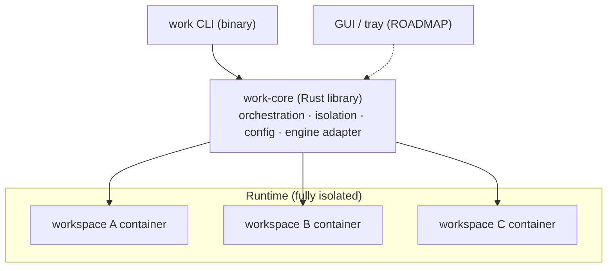

# `work` — Isolated Multi-Context Session Manager (CLI)

- **Date:** 2026-07-28
- **Status:** Design approved — pending implementation plan
- **Owner:** Lucas Coelho
- **Project:** `work-cli` · open source (MIT) · Rust
- **Scope:** v1 is a CLI; GUI/tray are on the roadmap (see Roadmap)
- **Targets:** macOS now, Linux later (shared codebase)

## Problem (generic)

Many developers juggle **multiple unrelated contexts** on one machine — an agency
with several clients, a contractor across employers, work-vs-personal, multiple
accounts — and increasingly drive **AI coding agents** that can read the filesystem
and persist memory across sessions. The hard requirement: **no context's code,
credentials, or agent-state may reach another.** Switching OS accounts is
inconvenient; swapping env vars is insufficient because an agent running as the user
can read sibling directories.

## What `work` is — and isn't

`work` is a **session + isolation manager**. It gives each context an isolated,
persistent container and lets you run and switch between them concurrently from one
terminal, with a structural guarantee against cross-context data breach.

- ✅ **It does:** create isolated environments (container + volume + network); let
  you shell in / attach / open them together in tmux; verify isolation.
- ❌ **It deliberately does not:** install tools, manage logins or credentials, or be
  opinionated about what runs inside. **The user installs their own tools (Claude
  Code, Codex, z.ai, Gemini CLI, …) and authenticates them themselves**, inside the
  container. `work` never touches secrets.

> **Documented example (not the definition).** Lucas works across three companies —
> `lagoasoft`, `shopvision`, `coda` — each with its own Claude Code / Codex / z.ai
> subscriptions. These are just three `work` workspaces; the tool is generic.

## Goal / Non-goals

**Goal.** An open-source CLI, `work`, built on a shared Rust core that creates and
drives one **isolated, persistent Linux container per workspace** via a
container-engine abstraction, enforcing isolation at the container/network/volume
boundary, fully user-configured (no hardcoded contexts).

**Non-goals (v1).**

- Installing or provisioning tools; managing credentials/logins.
- GUI / menu-bar tray (roadmap).
- Defending against a malicious host-level attacker or kernel/container escape.
- Replacing git — `work` just isolates the environment.
- A long-running daemon (deferred; see Roadmap).

## Threat model

The adversary is a **non-malicious AI coding agent** that may read the filesystem
and persist memory/context across sessions. Cross-context reads/exfiltration are
prevented by OS-level container boundaries. Containers share the host kernel
(acceptable for this model); escalate to full VMs only if a hostile-workload
requirement emerges. Directory/env-var switching is explicitly rejected — it does
not stop an agent running as the user from reading sibling directories.

## Architecture (v1 = core + CLI)

Isolation logic lives in **exactly one place** — the core library. The CLI is a thin
client. A GUI/tray (later) will be an additional client of the same core.



**Workspace layout**

```
work-cli/
  Cargo.toml                 # workspace
  crates/
    core/                    # work-core lib: orchestration, isolation, config, engine adapter
    cli/                     # `work` binary — thin client over core
  LICENSE                    # MIT
  README.md  CONTRIBUTING.md
```

## Runtime isolation (the confidentiality wall)

- **Container engine:** abstracted — auto-detect OrbStack → Docker → Podman → Colima
  (or take from config). Not locked to OrbStack.
- **One persistent container per workspace**, from a base image (default below;
  overridable per workspace).
- **Per-workspace named Docker volume** mounted at `/home/dev` — entire home persists
  (whatever the user installs, their creds, repos, dotfiles). Repos under `~/repos`.
- **Per-workspace dedicated bridge network** (`work-net-<ws>`), each NAT'd to the
  internet independently. Workspace containers **cannot address each other** (no
  shared L2), so there is no network path between workspaces.
- **Secrets live only inside the workspace's volume** — `work` never reads, writes,
  or moves them. They never touch the host filesystem via `work`.
- **Host-side config** (`~/.config/work/workspaces/<ws>.toml`) holds only non-secret
  metadata: display name, optional git identity, container image, volume/network names.

## Base image (default, overridable)

Default `work-base:latest`: `FROM node:20-bookworm-slim` + `git`, `openssh-client`,
`ca-certificates`, `tmux`, `zsh`, `curl`, `jq`, `build-essential`. Non-root user
`dev`. (Node included only as a common convenience for AI CLIs; the user may override
the image entirely via `work new --image ` or per-workspace config to use a
non-Node base.) Tool installs, logins, and credentials are **all the user's job**
inside the container; `work` provides the sandbox, not the contents.

## Per-workspace bootstrap — `work new <ws>`

1. Create volume `work-<ws>-home` and network `work-net-<ws>`.
2. Start container `work-<ws>` from the (default or configured) base image, on its
   own network, volume at `/home/dev`, running as `dev`.
3. If a git identity is configured, apply `user.name` / `user.email` (optional —
   purely to prevent wrong-identity commits; the user may also set it themselves).
4. Print next steps: shell in with `work <ws>`, then install/log into your own tools.

No tool installation, no login orchestration.

## Bring-your-own tools & login

The user installs and authenticates their tools themselves inside the workspace
(e.g. `npm i -g @anthropic-ai/claude-code` then `claude login`). Since OAuth
subscription logins need their callback port reachable from the host browser, `work`
offers an **opt-in manual helper**:

- `work fwd <ws> <port>` — forward a host port to a port inside the workspace, so the
  user can complete their own browser OAuth. `work` does not run or orchestrate the
  login; it just bridges a port when asked.

## CLI surface

| Command | Effect |
|---|---|
| `work new <ws>` | create isolated env: volume + network + container (+ optional git identity) |
| `work <ws>` | ensure running; exec an interactive shell |
| `work all` | tmux session `work`, one window per workspace |
| `work ls` | list workspaces + container/volume status |
| `work start <ws>` / `work stop <ws>` / `work stop --all` | lifecycle |
| `work fwd <ws> <port>` | (opt-in) forward a host port into the workspace for your own logins |
| `work config <ws>` | edit workspace metadata (image, git identity, etc.) |
| `work image build` | rebuild/customize the base image |
| `work doctor` | isolation + engine sanity check |

## Open-source project

- **License:** MIT.
- **Distribution:** `cargo install`, Homebrew tap, and per-release static binaries
  (GitHub Releases) for macOS (arm64/x86_64) and Linux.
- **Docs:** README quickstart ("create a workspace, shell in, install your own
  tools"); CONTRIBUTING. The README lists AI tools known to work inside (Claude Code,
  Codex, z.ai, Gemini CLI, …) as guidance, not as managed integrations.
- **Engine adapter** abstracts OrbStack/Docker/Podman/Colima so contributors on any
  runtime can use it.

## Roadmap (post-v1)

1. **Tauri app** — menu-bar tray (status / start-stop / one-click "switch into") +
   full management GUI, both as clients of `work-core`. Frontend: Svelte + TS.
2. **`workd` daemon** — single owner of container state over a Unix socket, if
   CLI+GUI contention requires it.
3. **Linux hardening** — verify Podman/Colima paths, tray parity, packaging.

## Sequencing (v1)

1. **Phase 0 — Environment:** install a container engine (OrbStack recommended) +
   Rust toolchain.
2. **Phase 1 — Core engine:** `work-core` lib + CLI; config model; engine adapter;
   `new`/`start`/`stop`/`<ws>`/`ls`/`all`/`doctor`; container/volume/network
   orchestration; isolation enforcement; default base image. **End-to-end: create a
   workspace, shell in, verify isolation with `work doctor`.**
3. **Phase 2 — Flexibility:** per-workspace custom images, config editing, opt-in
   `work fwd` port forward, robust `work doctor`, `stop --all`.
4. **Phase 3 — OSS hardening:** MIT license, README/quickstart, CONTRIBUTING, tests,
   `cargo install` + Homebrew formula + release binaries.

## Isolation guarantees — what `work doctor` enforces

- Each workspace container is on a **unique network**; no two workspaces share a network.
- Each container's **only** mount is its own home volume; no host bind-mounts.
- No workspace's volume is mounted into any other container.
- `work` never injects one workspace's env vars or keys into another's container
  (it holds no secrets at all).

## Risks / open questions

1. **Engine adapter parity** — verify Podman/Colima compatibility beyond OrbStack/Docker.
2. **uid mapping** for named-volume file ownership — verify across engines.
3. **User-side OAuth** — document the `work fwd` workflow clearly so users can
   complete subscription logins inside a container.
4. **Example identifiers** — `lagoasoft` / `shopvision` / `coda` confirmed as example
   workspaces.
