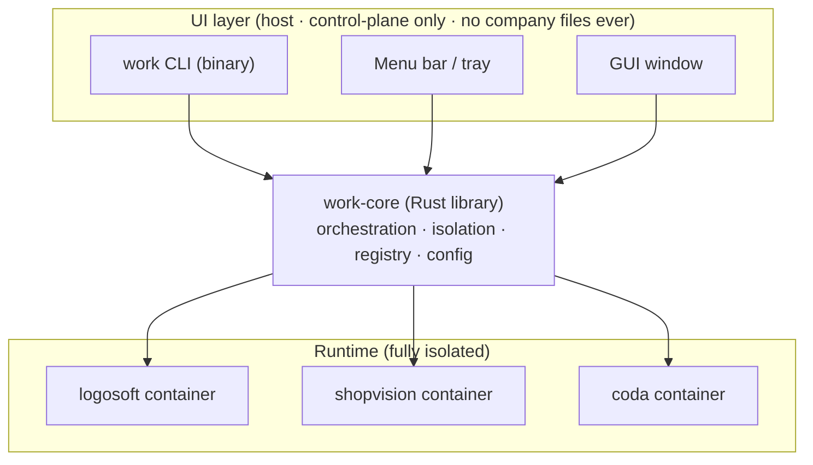

# `work` — Multi-Company Isolated Development Platform

- **Date:** 2026-07-28
- **Status:** Design approved — pending implementation plan
- **Owner:** Lucas Coelho
- **Stack:** Rust + Tauri · targets macOS and Linux

## Problem

Work across three companies (**Logosoft**, **Shopvision**, **Coda**) on a single Mac,
concurrently. Each company has its own AI tool subscriptions, git account, and
repositories, with a **hard confidentiality boundary**: no company's code,
credentials, or AI-agent state may reach another company.

**Hard constraints**

- No macOS user-account switching — driven from one login session.
- Companies run **concurrently**, on-screen at the same time.
- Workflow is "managing AI agents to code," almost entirely terminal-based.
- **Tool-pluggable**: support as many terminal coding agents as possible, not a
  hardcoded set.
- **Two first-class UIs**: a menu-bar/system tray *and* a full management GUI, in
  addition to the CLI.
- **Cross-platform**: macOS now, Linux later (shared codebase).

**Current tool subscriptions per company**

| Company   | Claude Code | Codex | z.ai (GLM) |
|-----------|:-----------:|:-----:|:----------:|
| Logosoft  | ✓           | ✓     |            |
| Shopvision| ✓           | ✓     |            |
| Coda      | ✓           |       | ✓          |

(Cursor was considered and dropped — CLI-only, per decision. The registry supports
adding further terminal agents: Gemini CLI, Qwen Code, Aider, OpenCode, Goose,
Crush, Amazon Q CLI, Copilot CLI, Cody, Amp, etc.)

## Goal / Non-goals

**Goal.** A platform, `work`, built on a shared Rust core that creates and drives one
**isolated, persistent Linux container per company** (via OrbStack), enforces
isolation at the container/network/volume boundary, and is drivable from a CLI, a
menu-bar tray, and a GUI — all as control-plane clients of the core. Secrets never
leave a company's container.

**Non-goals.**

- GUI coding tools (Cursor dropped).
- Defending against a malicious host-level attacker or kernel/container escape.
- Managing billing or the subscriptions themselves.
- Replacing git — `work` just scopes git per company.
- A long-running daemon in v0 (deferred; see Sequencing).

## Threat model

The adversary is a **non-malicious AI coding agent** that may read the filesystem
and persist memory/context across sessions. Cross-company reads/exfiltration are
prevented by OS-level container boundaries. Containers share the host kernel
(acceptable for this model); escalate to full VMs only if a hostile-workload
requirement emerges. Directory/env-var switching alone is explicitly rejected — it
does not stop an agent running as the user from reading sibling directories.

## Layered architecture

Isolation logic lives in **exactly one place** — the core library. Every UI is a
thin control-plane client. No company files are ever read or stored on the host by
any UI layer.



**Workspace layout**

```
work-cli/
  Cargo.toml                 # workspace
  crates/
    core/                    # work-core lib: orchestration, isolation, registry, config
    cli/                     # `work` binary — thin client over core
  app/
    src-tauri/               # Tauri backend (Rust) — links work-core; tray + window
    src/                     # Svelte + TypeScript frontend
```

A daemon (`workd`) over a Unix socket is **deferred** — added only in a later phase
if CLI and GUI contention over docker state demands a single owner. For v0, CLI and
Tauri app each link `work-core` directly; the tray polls `docker` for live status.

## Runtime isolation (the confidentiality wall)

- **Runtime:** OrbStack (lightweight Linux VM + Docker engine) on Apple Silicon.
- **One persistent container per company**, from a shared base image
  `work-base:latest`.
- **Per-company named Docker volume** mounted at `/home/dev` — entire home persists
  (tools, credentials, repos, dotfiles). Repos under `~/repos`.
- **Per-company dedicated bridge network** (`work-net-<co>`), each NAT'd to the
  internet independently. Company containers **cannot address each other** (no
  shared L2), so there is no network path between companies.
- **Secrets live only inside the company's volume** — OAuth tokens, SSH private
  keys, API keys are never written to the host filesystem in plaintext.
- **Host-side config** (`~/.config/work/companies/<co>.toml`) holds only non-secret
  metadata: display name, git identity, enabled tools, volume/network names, image tag.

## Base image (`work-base:latest`)

`FROM node:20-bookworm-slim` (Claude Code, Codex CLI, z.ai coding-helper, and most
terminal agents are Node-based). Adds: `git`, `openssh-client`, `ca-certificates`,
`tmux`, `zsh`, `curl`, `jq`, plus any per-tool system deps declared in the registry.
Creates a non-root user `dev` (Claude Code refuses root). Tool installs happen
in-container at bootstrap and persist via the home volume.

## Tool registry

Tools are **data, not code**. Each terminal agent is a definition consumed by
`work-core`:

```toml
# schema (illustrative)
[tool.claude-code]
install = "npm i -g @anthropic-ai/claude-code"
config_dir = "~/.claude"
login = "oauth"          # oauth | apikey | none
env = { CLAUDE_CONFIG_DIR = "~/.claude" }

[tool.codex]
install = "npm i -g @openai/codex"
config_dir = "~/.codex"
login = "oauth"

[tool.zai]
install = "npm i -g @z_ai/coding-helper"
login = "apikey"
env = { ZAI_API_KEY = "" }
```

A company enables a subset; `work new`/`work login` iterate over the enabled set.
Most agents share the npm + config-dir + oauth-or-apikey shape, so the registry
stays small and extensible.

## Per-company bootstrap — `work new <co>`

1. Create volume `work-<co>-home` and network `work-net-<co>`.
2. Start container `work-<co>` from `work-base`, on its own network, volume at
   `/home/dev`, running as `dev`.
3. Apply git identity (`user.name` / `user.email`) from config.
4. Generate an SSH ed25519 keypair in `~/.ssh`; print the public key to add to that
   company's git account.
5. Install the company's enabled tools from the registry.
6. Run the `work login <co>` flows.

## Auth flow — `work login <co>`

- **oauth tools (Claude Code, Codex, …):** OAuth login executed **inside the
  container**; the CLI forwards the OAuth callback port to the host so the host
  browser completes the flow; token persists in the volume (real paid subscription).
- **apikey tools (z.ai, …):** `work login` prompts for the key, stores it in the
  container env/config (in-volume).
- **Fallback:** API-key / usage-based mode for any tool if OAuth proves infeasible.

## CLI surface

| Command | Effect |
|---|---|
| `work new <co>` | bootstrap container + volume + network + identity + tools |
| `work <co>` | ensure running; exec an interactive shell |
| `work all` | tmux session `work`, one window per company |
| `work clone <co> <url>` | clone a repo into `~/repos` as that company's identity |
| `work login <co>` | run tool logins (see Auth flow) |
| `work ls` | list companies + container/volume status |
| `work start <co>` / `work stop <co>` / `work stop --all` | lifecycle |
| `work config <co>` | edit company metadata |
| `work image build` | rebuild the base image |
| `work doctor` | isolation sanity check |

## UI (Tauri: tray + window, both first-class)

One Tauri app provides two surfaces sharing one Rust backend that links `work-core`:

- **Tray menu** — at-a-glance status per company (running/stopped), start/stop, and
  one-click **"switch into"** (opens a host terminal that `docker exec`s into the
  container). Lives in the menu bar (macOS) / system tray (Linux).
- **GUI window** — create/edit companies, enable/disable tools, trigger logins, view
  per-company status and recent logs, open terminals.
- **Frontend:** Svelte + TypeScript (small, Tauri-friendly; swappable for React).
- **Isolation-preserving:** the UI shows only metadata + status and triggers actions
  via `work-core`. It never reads or displays company file contents — and cannot,
  since files live in named volumes inaccessible to the host.

## Stack & dependencies

- **Rust** (`rustup`) for `work-core`, the CLI, and the Tauri backend.
- **Tauri v2** for the desktop app + tray (native, small, cross-platform).
- **Docker via `std::process::Command`** for v0 (simple, debuggable); consider the
  `bollard` API client later if needed.
- **OrbStack** as the container runtime on macOS.
- **macOS build deps:** Xcode Command Line Tools. **Linux deps:** webkit2gtk et al.

## Sequencing

1. **Phase 0 — Environment:** install OrbStack + Rust toolchain + Tauri deps.
2. **Phase 1 — Core engine:** `work-core` lib + CLI; config model;
   `new`/`start`/`stop`/`<co>`/`ls`/`clone`/`doctor`; container/volume/network
   orchestration; isolation enforcement; **one tool (Claude Code) working end-to-end
   for one company**.
3. **Phase 2 — Registry + auth + all companies:** registry data model; add Codex and
   z.ai; in-container OAuth flow; stand up all three companies.
4. **Phase 3 — Tauri shell:** tray menu + window scaffold, status polling,
   start/stop/switch actions (linking `work-core`).
5. **Phase 4 — Full GUI:** company management, tool enable/install, logins, logs.
6. **(Later) `workd` daemon** — only if CLI+GUI state contention requires it.

## Isolation guarantees — what `work doctor` enforces

- Each company container is on a **unique network**; no two companies share a network.
- Each container's **only** mount is its own home volume; no host bind-mounts.
- No company's volume is mounted into any other container.
- `work` never injects one company's env vars or keys into another's container.

## Risks / open questions

1. **OAuth callback forwarding under OrbStack** — verify port-publishing behavior for
   in-container OAuth; API-key is the fallback.
2. **uid mapping** for named-volume file ownership — OrbStack handles this; verify.
3. **Claude Code Max device limits** — confirm multiple concurrent container logins
   are permitted under the subscription.
4. **Tauri tray parity on Linux** — confirm StatusNotifierItem behavior matches macOS
   menu bar; verify when Linux target becomes active.
5. **Company identifiers** — confirm canonical spellings (`logosoft` / `shopvision` /
   `coda`); "lagoasoft" appeared in conversation.
