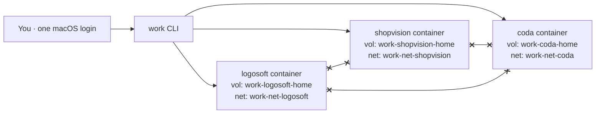

# `work` — Multi-Company Isolated Development CLI

- **Date:** 2026-07-28
- **Status:** Design approved — pending implementation plan
- **Owner:** Lucas Coelho

## Problem

Work across three companies (**Logosoft**, **Shopvision**, **Coda**) on a single Mac,
concurrently. Each company has its own AI tool subscriptions, git account, and
repositories, with a **hard confidentiality boundary**: no company's code,
credentials, or AI-agent state may reach another company.

**Hard constraints**

- No macOS user-account switching — everything is driven from one login session.
- Companies run **concurrently**, on-screen at the same time.
- Workflow is "managing AI agents to code," i.e. almost entirely terminal-based.

**Tool subscriptions per company**

| Company   | Claude Code | Codex | z.ai (GLM) |
|-----------|:-----------:|:-----:|:----------:|
| Logosoft  | ✓           | ✓     |            |
| Shopvision| ✓           | ✓     |            |
| Coda      | ✓           |       | ✓          |

(Cursor was considered and dropped — going CLI-only, per decision.)

## Goal / Non-goals

**Goal.** A CLI, `work`, that creates and drives one **isolated, persistent Linux
container per company** (via OrbStack), enforcing isolation at the container,
network, and volume boundaries. Secrets never leave a company's container.

**Non-goals.**

- GUI apps (Cursor dropped).
- Defending against a malicious host-level attacker or kernel/container escape.
- Managing billing or the subscriptions themselves.
- Replacing git — `work` just scopes git per company.

## Threat model

The adversary is a **non-malicious AI coding agent** that may read the filesystem
and persist memory/context across sessions. We prevent cross-company reads or
exfiltration using OS-level container boundaries. Containers share the host kernel
(acceptable for this model); we escalate to full VMs only if a hostile-workload
requirement emerges. Directory/env-var switching alone is explicitly rejected — it
does not stop an agent that runs as the user from reading sibling directories.

## Architecture

- **Runtime:** OrbStack (lightweight Linux VM + Docker engine) on Apple Silicon.
- **One persistent container per company**, from a shared base image
  `work-base:latest`.
- **Per-company named Docker volume** mounted at `/home/dev` — the entire home
  persists (tools, credentials, repos, dotfiles). Repos live under `~/repos`.
- **Per-company dedicated Docker bridge network** (`work-net-<co>`), each NAT'd to
  the internet independently. Company containers **cannot address each other** (no
  shared L2 segment), so there is no network path between companies.
- **Secrets live only inside the company's volume** — OAuth tokens, SSH private
  keys, API keys are never written to the host filesystem in plaintext.
- **Host-side config** `~/.config/work/companies/<co>.toml` holds only non-secret
  metadata: display name, git identity, enabled tools, volume/network names, image tag.

## Base image (`work-base:latest`)

`FROM node:20-bookworm-slim` (Claude Code, Codex CLI, and z.ai coding-helper are all
Node-based). Adds: `git`, `openssh-client`, `ca-certificates`, `tmux`, `zsh`, `curl`,
`jq`. Creates a non-root user `dev` (Claude Code refuses to run as root). Tool
installs happen in-container at bootstrap and are persisted via the home volume.

## Per-company bootstrap — `work new <co>`

1. Create volume `work-<co>-home` and network `work-net-<co>`.
2. Start container `work-<co>` from `work-base`, on its own network, volume at
   `/home/dev`, running as user `dev`.
3. Apply git identity (`user.name` / `user.email`) from config.
4. Generate an SSH ed25519 keypair in `~/.ssh`; print the public key so the user can
   add it to that company's git account.
5. Install enabled tools (npm globals): `@anthropic-ai/claude-code`, `@openai/codex`,
   `@z_ai/coding-helper`.
6. Run the `work login <co>` flows.

## Auth flow — `work login <co>`

- **Claude Code / Codex:** OAuth subscription login executed **inside the container**.
  The CLI forwards the OAuth callback port to the host so the host browser completes
  the flow; the token persists in the volume and uses the real paid subscription.
- **z.ai (GLM):** API-key based — `work login` prompts for the key and stores it in
  the container env/config (in-volume).
- **Fallback:** API-key / usage-based mode for any tool if OAuth proves infeasible.

## CLI surface

| Command | Effect |
|---|---|
| `work new <co>` | bootstrap container + volume + network + identity + tools |
| `work <co>` | ensure running; exec an interactive shell |
| `work all` | tmux session `work` with one window per company, each a live shell in that container |
| `work clone <co> <url>` | clone a repo into `~/repos` as that company's identity |
| `work login <co>` | run tool logins (see Auth flow) |
| `work ls` | list companies + container/volume status |
| `work start <co>` / `work stop <co>` / `work stop --all` | lifecycle |
| `work config <co>` | edit company metadata |
| `work image build` | rebuild the base image |
| `work doctor` | isolation sanity check |

## Isolation guarantees — what `work doctor` enforces

- Each company container is on a **unique network**; no two companies share a network.
- Each container's **only** mount is its own home volume; no host bind-mounts.
- No company's volume is mounted into any other container.
- `work` never injects one company's env vars or keys into another's container.

## Implementation language

**Bash** for v0 — zero dependencies, directly orchestrates `docker`/`tmux`/`git`,
easy for the owner to read and modify. A Go rewrite is a later option.

## Risks / open questions

1. **OAuth callback forwarding under OrbStack** — verify OrbStack's port-publishing
   behavior for in-container OAuth; API-key is the fallback.
2. **uid mapping** for named-volume file ownership — OrbStack handles this; verify.
3. **Claude Code Max device limits** — confirm multiple concurrent container logins
   are permitted under the subscription.
4. **Company identifiers** — confirm canonical spellings (`logosoft` / `shopvision` /
   `coda`); note "lagoasoft" appeared in conversation.
