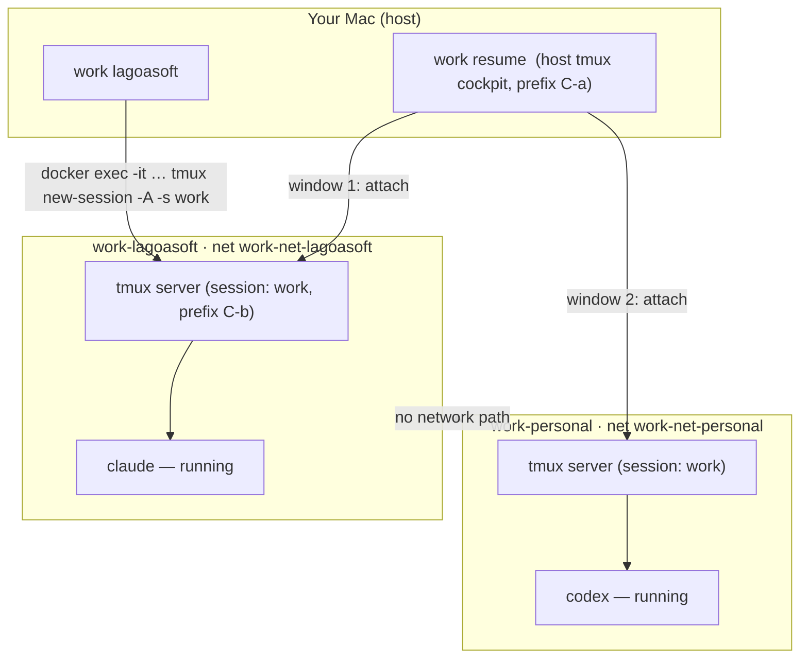

# `work` — Persistent Sessions, Cockpit, Familiarity, Removal & Safety

- **Date:** 2026-07-28
- **Status:** Design — pending implementation plan
- **Owner:** Lucas Coelho
- **Project:** `work-cli` · open source (MIT) · Rust
- **Builds on:** `docs/superpowers/specs/2026-07-28-work-cli-design.md` (the v1 product spec) and the shipped v1 (Phases 1–3).

## Context — the gap this closes

v1 `work` creates isolated workspaces (container + volume + dedicated network) and
shells in, but **`work <ws>` opens a fresh, ephemeral shell every time.** There is
no persistent session, no way to watch several running AI agents at once, no
familiar shell environment, and no way to remove a workspace. This spec adds the
**workflow layer** that makes `work` a real session/orchestration product rather
than thin container orchestration.

## Goal / Non-goals

**Goal.** Make each workspace a **persistent, resumable session** that survives
terminal close; provide a **cockpit** to view/switch all live sessions; land users
in a **familiar shell**; add **`work rm`**; and enforce a **uniform destructive-
operation safety policy** — all without weakening isolation.

**Non-goals (this iteration).**
- Remote / SSH attach from other machines (explicitly next version).
- GUI / tray (Tauri) and the `workd` daemon (roadmap).
- An "agent" abstraction — an agent is just a process inside a session.
- Keeping agents alive across `work stop` (stop is an explicit power-off).

## Locked decisions (do not relitigate)

- **Sessions live INSIDE each container** (in-container tmux), not on the host and
  not behind a daemon. The host multiplexer is used ONLY to tile the cockpit view.
- **Shell-config / tmux-config seeding is opt-in and per-workspace**, never
  automatic, copied verbatim with a warning. `work` never moves secrets.
- **`work rm` keeps the volume by default** (data-safe); `--purge` deletes it and
  requires `--yes`. This matches `work`'s stance of never destroying user data
  without an explicit instruction.
- **Every destructive operation warns and confirms** (two severities — see Part 6).
- Isolation model from the v1 spec is unchanged: one container + one volume
  (`work-<ws>-home` @ `/home/dev`) + one network (`work-net-<ws>`) per workspace.

## Architecture

Each workspace container runs a **persistent tmux server** with a single session
named `work`. Clients attach/detach; the session (and any agents started inside)
keeps running while the container runs.

The host multiplexer only tiles views; each cockpit window is a `docker exec` into
one container on its own network. **No path between containers is created**, so
isolation is preserved.

---

## Part 1 — Persistent in-container sessions

- `work <ws>` becomes **attach-or-create**: ensure the container is running, then
  `docker exec -it work-<ws> tmux new-session -A -s work -- <shell> -l`.
  - `-A` attaches if the `work` session exists, creates it otherwise.
  - `<shell>` is the workspace's configured shell (see Part 4), default `zsh`.
- **Persistence semantics (documented to users):**
  - Survives: detach, closing the terminal/tab, switching contexts, host sleep.
  - Does **not** survive: `work stop` (explicit power-off — running processes end;
    files, installed tools, and on-disk agent state in the volume persist), or
    container removal.
  - Reboot: the container auto-restarts (`--restart unless-stopped`), but a **fresh**
    tmux session starts (same as apps reopening after a reboot).
- The base image already contains `tmux` and `zsh`; **add `bash`** so a host bash
  user gets a matching shell.
- **Detach hint:** `work <ws>` prints one line to the terminal immediately before
  attaching: `Ctrl-b d or close terminal = detach (keeps running) · exit = close session`.

**Engine additions (`crates/core/src/engine.rs`):**
- `fn session_exists(&self, name: &str, session: &str) -> Result<bool>` — runs
  `docker exec <name> tmux has-session -t <session>`; success → true, non-zero → false.
- The attach reuses the existing `exec_interactive` (passing
  `["tmux","new-session","-A","-s","work","--",shell,"-l"]`).

## Part 2 — The cockpit (`work resume`)

- `work resume` opens ONE **host** tmux session (named `work`) with **one window per
  running workspace**, each window running
  `docker exec -it work-<ws> tmux attach -t work` (or `new-session -A` if absent).
- **Distinct prefix:** the cockpit host tmux uses prefix **`Ctrl-a`** (set when the
  session is created) so it doesn't collide with the in-container `Ctrl-b`.
- Only workspaces whose container is **running** are tiled; stopped ones are listed
  in a footer note (`stopped: coda, shopvision — work start <ws> to include`).
- If no workspaces are running, print guidance (`work new <ws>` / `work start <ws>`).
- `work all` remains as an alias for `work resume`.

## Part 3 — `work ls` session column

- Add a **SESSION** column (`live` / `—`) using `session_exists(name, "work")`.
- Output columns: `WORKSPACE`, `STATE` (running/stopped/missing), `SESSION` (live/—).

## Part 4 — Familiarity (shell detection + opt-in seeding)

**4a. Shell detection (automatic, safe).**
- At `work new`, read host `$SHELL`, take the basename (`zsh` / `bash`), store it in
  `WorkspaceConfig.shell` (field already exists), fallback `zsh`. `work <ws>` and the
  in-container tmux session use this shell.

**4b. Shell-config seeding (opt-in, per-workspace, verbatim, warned).**
- `work new <ws> --import-shell-config [<path>]`:
  - No path → copy the detected rc (`~/.zshrc` / `~/.bashrc`).
  - With path → copy that file.
  - Destination: `/home/dev/.<rcname>` (e.g. `.zshrc`), owned by `dev`.
  - Prints a clear warning: *"Copied your <rc> into <ws>. Ensure it contains no
    secrets — it now lives in that workspace's volume."*
- Optional **global default** in `~/.config/work/config.toml`:
  `import_shell_config = "<path>"` (applies to every `work new` unless overridden;
  still off by default; same warning).
- **`--import-tmux-config [<path>]`**: identical treatment for `.tmux.conf` →
  `/home/dev/.tmux.conf`. Useful now that tmux is central to the experience.
- **First-run prompt suppression:** because the volume mounts over `/home/dev`, a
  `.zshrc` baked into the image is hidden. So at `work new`, after the container
  starts, ensure `/home/dev/.<rc>` exists — either the imported file or an **empty**
  one — so zsh's new-user prompt never fires. (If the user imports later via
  `work config --edit`, it overwrites.)

**Why isolation-safe:** each workspace gets its own copy in its own volume; nothing
is shared across workspaces unless the user explicitly seeds each. The cross-context
guarantee (A's data can't reach B) is untouched. The only risk is the user's own
secret in their own rc landing in a workspace they seeded — hence the warning and
the per-workspace (not blanket) default.

**Engine addition:** `fn seed_file(&self, name: &str, src: &Path, dest: &str) ->
Result<()>` — `docker cp <src> <name>:<dest>` then chown to `dev`.

**Honest caveat (documented):** a copied rc may reference host paths or source files
that don't exist in the container; the copy is verbatim and best-effort.

## Part 5 — `work rm`

- `work rm <ws> [--purge]`:
  - **Default:** stop + remove the container, remove the network, delete the config
    file. **Keep the volume.** Print: *"removed workspace '<ws>' (volume
    work-<ws>-home kept). `work new <ws>` recreates it with your files intact;
    `work rm <ws> --purge` deletes the volume."*
  - **`--purge`:** also remove the volume (irreversible). Subject to the data-loss
    safety rule (Part 6).
- Keeping the volume by default means `work rm` + `work new` = "reset the container,
  keep my files." `work new` already reuses an existing volume.
- `rm` is already in the reserved-name list and the bare-name dispatcher; add an
  `Rm { ws: String, #[arg(long)] purge: bool }` command variant.

## Part 6 — Destructive-operation safety policy (uniform, all commands)

**Two severities:**

1. **Data loss (irreversible — volume deletion):** `work rm <ws> --purge`.
   - Requires explicit `--yes` OR an interactive confirm.
   - In a non-interactive context (no TTY / CI / pipe): **refuses** with an error
     unless `--yes` is supplied. Never hangs, never silently destroys.

2. **Work loss (kills a live session/agents, data safe):** `work stop`, `work
   stop-all`, `work rm` (default), and `work config --edit` when it triggers a
   container recreate.
   - Warns **only when there is something to lose** — i.e. the workspace currently
     has a **live session** (via `session_exists`). Example:
     `stopping 'lagoasoft' will end its 1 running session — continue? [y/N]`.
   - If no session is live, the operation proceeds silently (no nag).

**Confirmation UX (consistent everywhere):**
- Prompts appear **only when stdin is a TTY**. With no TTY, destructive ops require
  `--yes` or abort with a clear error.
- A **global `--yes` / `-y`** (top-level flag) skips all confirms (script-friendly).
- Pure-safe ops (`start`, `ls`, `new`, `fwd`, `doctor`, `config` show) never warn.

---

## CLI surface (additions/changes)

| Command | Change |
|---|---|
| `work <ws>` | attach-or-create persistent in-container tmux session; detach hint. |
| `work resume` (=`work all`) | cockpit: host tmux tiling all running workspaces' sessions. |
| `work ls` | + SESSION column. |
| `work new <ws>` | + shell auto-detection (stored in config). Flags: `--import-shell-config [<path>]`, `--import-tmux-config [<path>]`. |
| `work rm <ws> [--purge]` | NEW. Remove container+network+config (keep volume); `--purge` deletes volume. |
| `work stop` / `stop-all` / `config --edit` | warn on live-session loss per Part 6. |
| `work --yes` / `-y` | NEW global flag: skip all confirms. |

## Isolation impact

**None.** No new cross-container network or mount is introduced. The cockpit's host
tmux only spawns `docker exec` clients into individual containers on their own
networks; it creates no path between them. `work doctor` continues to enforce:
unique network per workspace, only its own home volume mounted, no foreign volume,
non-root user, image match, no host ports. Add a doctor note that forwarder
(`work-fwd-*`) and cockpit attach processes are expected and not isolation
violations.

## File-level impact (implementation pointers)

- `crates/core/src/engine.rs` — add `session_exists`, `seed_file`.
- `crates/core/src/workspace.rs` — rewrite `shell()` to attach-or-create; add
  `forward`-style `resume()` cockpit helper; add `remove(purge)`; shell detection
  in `create()`; rc/tmux seeding helpers.
- `crates/core/src/config.rs` — `GlobalConfig.import_shell_config`,
  `GlobalConfig.import_tmux_config` (optional paths).
- `crates/core/src/doctor.rs` — `work ls` session probe lives in `workspace.rs`;
  doctor unchanged apart from the forwarder/cockpit note.
- `crates/cli/src/commands.rs` + `main.rs` — new commands/flags, global `--yes`,
  TTY-aware confirm helper.
- `crates/docker/work-base.Dockerfile` — add `bash`.
- Tests: unit-test the pure pieces (confirm-decision logic given "live session? /
  purge? / TTY? / --yes?" inputs → should-prompt / should-proceed); the tmux/docker
  paths verified at an end-to-end milestone.

## Risks / open questions

1. **Nested-tmux prefix friction** in the cockpit — mitigated by distinct prefixes
   (`C-a` host / `C-b` in-container) and the detach hint.
2. **rc host-path breakage** on import — documented as best-effort.
3. **tmux session vs. container lifecycle** — `work stop` ends sessions; document
   clearly so users don't expect agents to survive a power-off.
4. Terminal sizing on attach — tmux resizes to the client; verify no truncation.
